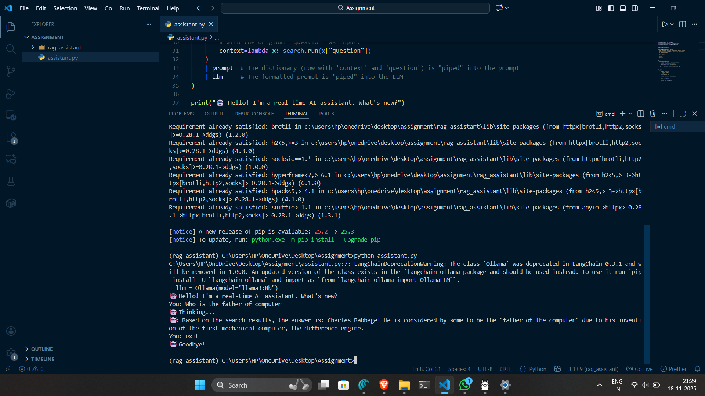

# 🤖 RAG Assistant  
A simple **Retrieval-Augmented Generation (RAG)** assistant built using **Python**, **LangChain**, **DuckDuckGo Search**, and **Ollama** (running Llama 3 locally).  
This project answers real-time questions using **search-based context** and a **local LLM**.

---

## ✨ Features

- 🔍 Uses **DuckDuckGo Search** to fetch real-time web results  
- 🧠 Uses **Ollama** with **Llama 3 (8B)** model for local text generation  
- 🛠️ Built using **LangChain Runnables + ChatPromptTemplate**  
- 💡 RAG pipeline (Search → Prompt → LLM)  
- ⚡ Fast, lightweight, and runs fully on your machine  
- 🖥️ Simple CLI chat interface  

---
## ➡️ Workflow

---

## 🚀 Getting Started

### 1️⃣ Install Python dependencies

```bash
pip install langchain_community langchain_core duckduckgo-search ollama
```

## 2️⃣ Install & Run Ollama

Download Ollama (Windows, Mac, Linux):
👉 https://ollama.com/download

Pull the required model:

```bash
ollama pull llama3:8b
```


Start the Ollama service:

```bash
ollama serve
```

## ▶️ Running the Assistant

Run the script:
```bash
python assistant.py
```


You will see:
```bash
🤖 Hello! I'm a real-time AI assistant. What's new?
You:
```

Ask anything:

```bash
You: Who is the father of computer?
🤖 Thinking...
🤖 Based on the search results...
```


To exit:

```bash
You: exit
```


## 🤖 OUPUT 



📝 Troubleshooting
Missing module?
```bash
pip install ddgs
```
